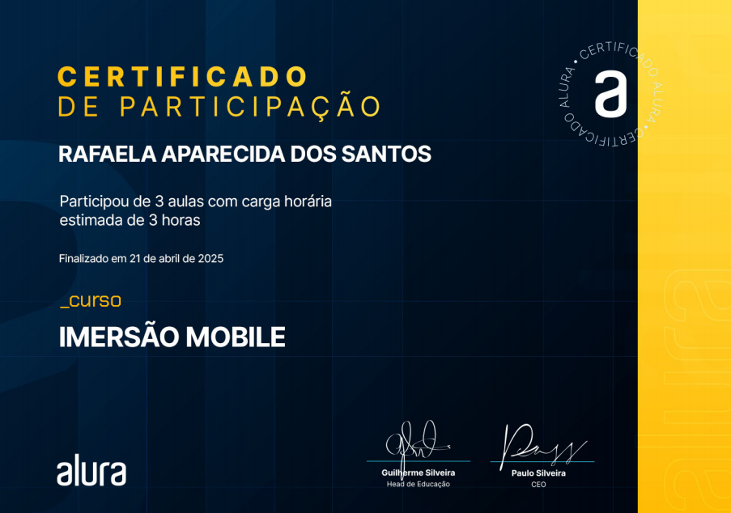

# 🍽️ Imersão Mobile - Alura (Flutter)

Este projeto foi desenvolvido durante a **Imersão Mobile da Alura**, com foco no desenvolvimento de aplicações mobile usando **Flutter**. Durante 3 dias intensivos, aprendi e evoluí muito com o conteúdo prático, mesmo já tendo alguma experiência na tecnologia.

O app simula um delivery de restaurantes, com funcionalidades como listagem de restaurantes, visualização de detalhes, gerenciamento de sacola (carrinho de compras) e tela de checkout.

## 🚀 Tecnologias e Ferramentas
- Flutter
- Dart
- Provider (Gerenciamento de estado)
- JSON (para simulação de dados)

## 📚 O que foi desenvolvido

### 🟡 Dia 1 - Primeiros passos e SplashScreen
- Importação de assets e estruturação de temas
- Criação da tela de Splash
- Uso dos principais widgets Flutter:
  - `Scaffold`, `Stack`, `Column`, `Padding`, `Image`, `Text`, `SizedBox`, `ElevatedButton`
- Criação dos arquivos de tema (`AppColor`, `AppTheme`)

### 🟢 Dia 2 - HomeScreen e navegação
- Implementação da navegação entre telas
- Criação da `HomeScreen` com `AppBar`, `Drawer` e `TextFormField`
- Modularização da interface com `CategoryWidget` e `RestaurantWidget`
- Modelagem do restaurante (`RestaurantModel`) com métodos `toMap()` e `fromMap()`
- Leitura de dados JSON com a classe `RestaurantData`
- Uso do `Provider` para exibição dinâmica dos restaurantes

### 🔵 Dia 3 - Detalhes, sacola e checkout
- Criação da tela de detalhes dos restaurantes
- Adição de pratos à sacola
- Implementação do `BagProvider` com métodos para adicionar, remover e limpar itens
- Modularização da `AppBar` com função `getAppBar()` e `Badge` com contagem de itens
- Modelagem de pratos (`DishModel`) e integração com sacola
- Desenvolvimento da tela de checkout com cálculo de total (`toStringAsFixed`)

## 🎓 Certificado

Ao final da imersão, recebi um **certificado de participação**, comprovando o aprendizado e conclusão do projeto.

## 👨‍🏫 Agradecimentos

Agradeço ao instrutor **Ricarth Lima** pela didática clara e objetiva, e à **Giovanna Moeller** pela ótima condução das aulas. A experiência foi enriquecedora!

## 🎥 Demonstração

Confira um vídeo rápido mostrando o funcionamento do app:

